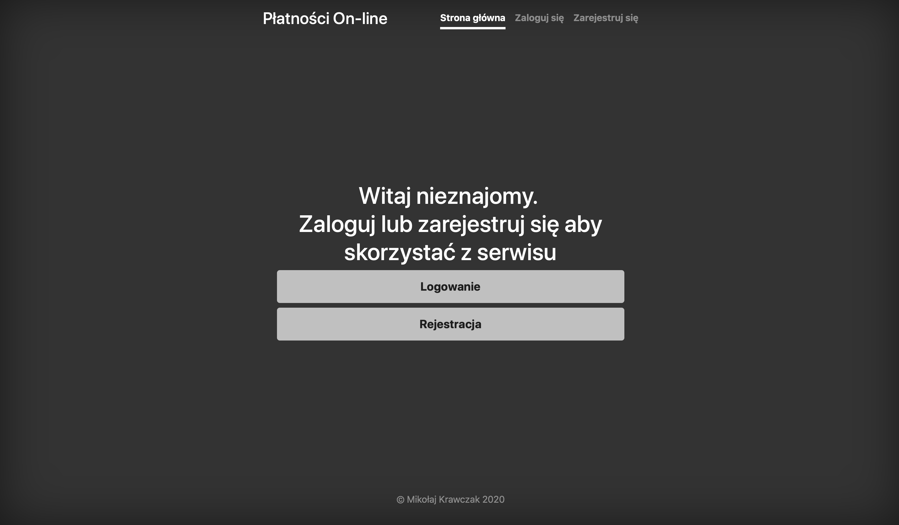
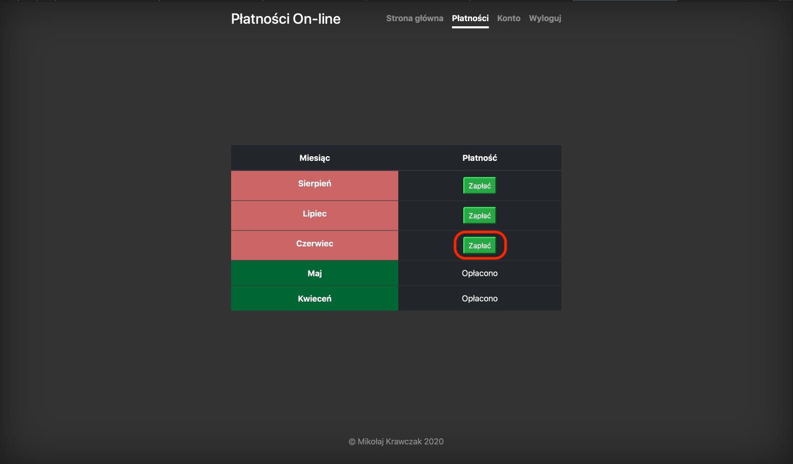
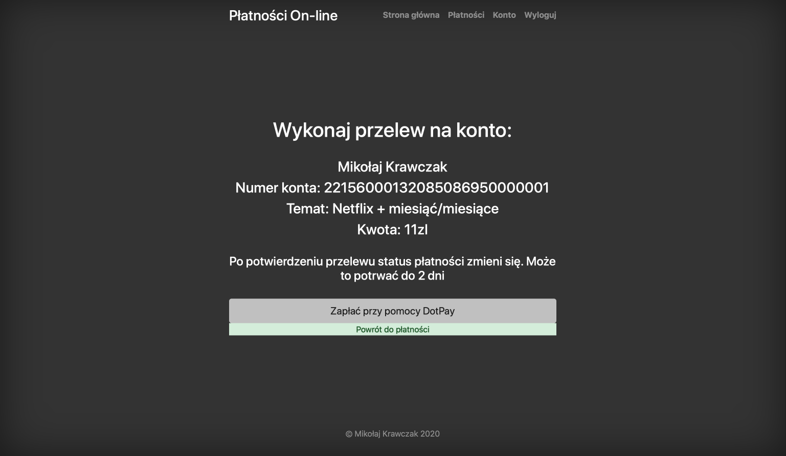
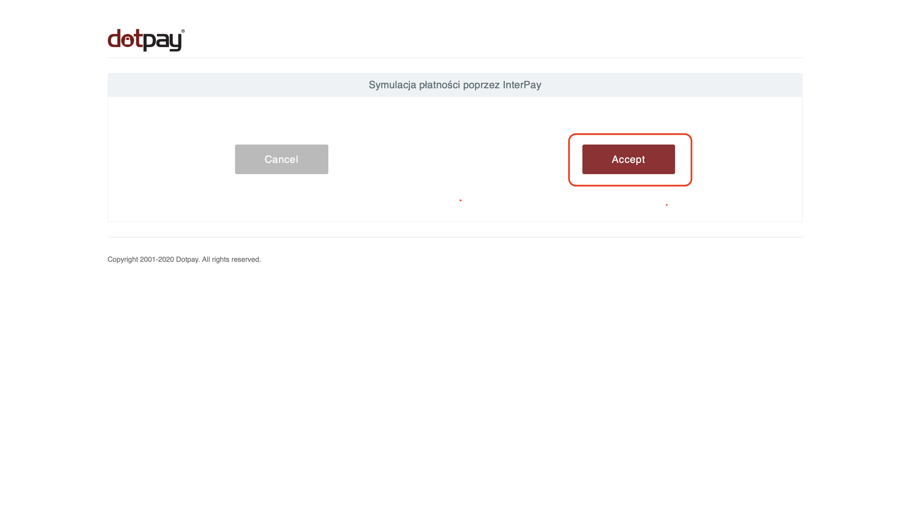
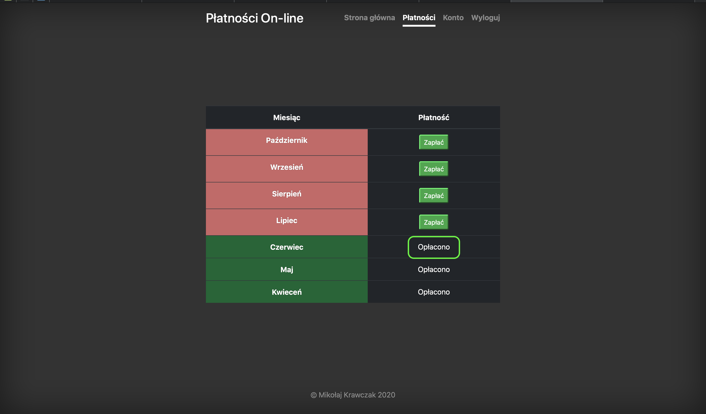

> The application has been designed as a tool to contributory payments for Netflix among friends by DotPay. 

## Table of contents
* [General info](#general-info)
* [Features](#features)
* [Technologies](#technologies)
* [Status](#status)
* [Inspiration](#inspiration)

## General info
>The main feature of the application is ability to check your past payments and make a new payments (for new month). Admin user can check who has already paid and who didn’t. The application simplifies contributory payments for the Netflix, by automation off this process and make easier- we can use DotPay. Here https://dotpaytest.herokuapp.com/pay-main you can try how  it works without any costs.  
## Features
### Login page
 
>  Page where the user can log in or create an account. 

### Payments view
 
> After login user can check his payments and make new payment.

### Payment view
 
>Here user can pay by bank transfer or DotPay.

### Pay by DotPay
 

>This is a test payment in the DotPay system. After the acceptation, the application will show information about the next month paid. 

## Technologies
* Java SE 11
* Spring boot
* Spring security
* Hibernate ORM 5.4.2
* REST API
* Docker
* Tomcat
* Maven 3.3.9
* Freemarker 2.3.29
* Bootstrap 4.3.1
* HTML5, CSS3, JS
* jQuery, AJAX
* Postgres

## Status
Project is: _finished_.

## Inspiration
Own idea.
